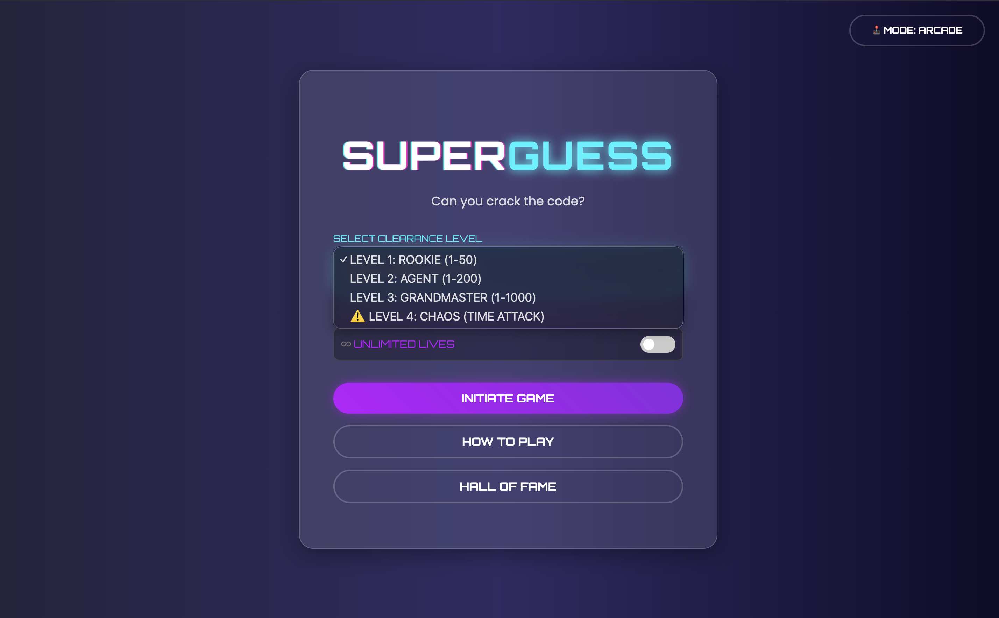
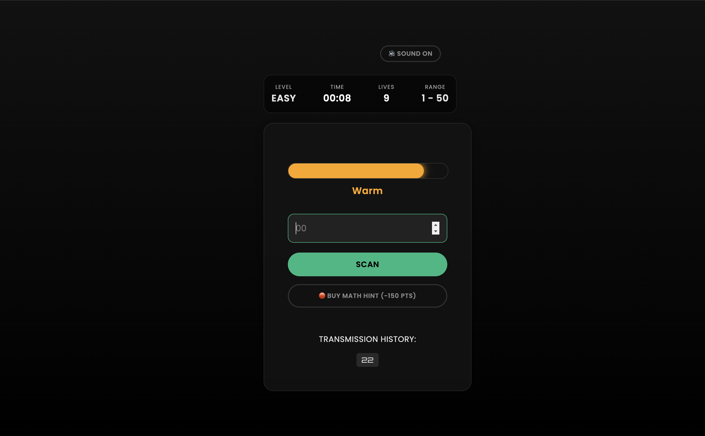
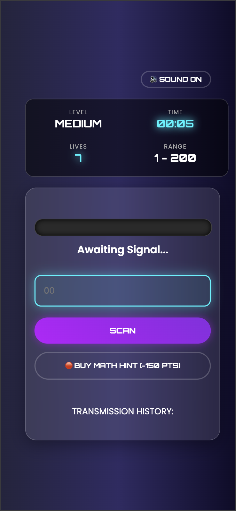
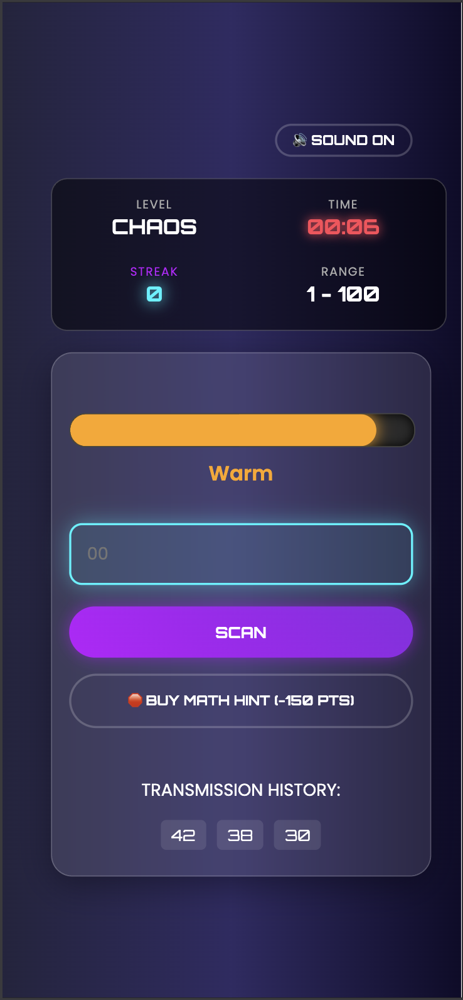

<div align = "center">
  
# 🔮 SuperGuess: The Ultimate Arcade Challenge


> **Can you crack the code before time runs out?**
> SuperGuess is a modern, full-stack web application that reinvents the classic "Guess the Number" game with arcade mechanics, dynamic visuals, and high-stakes gameplay.
---
**[Play SuperGuess Online](https://superguess-arcade.onrender.com)**

---


</div>

## ✨ Key Features

### 🎮 Gameplay Mechanics
- **4 Distinct Difficulty Levels:**
  - **Rookie (1-50):** Standard gameplay.
  - **Agent (1-200):** Expanded range.
  - **Grandmaster (1-1000):** The ultimate test of logic.
  - **⚠️ CHAOS MODE:** A time-attack frenzy. 30 seconds on the clock. Every win adds +10s. How high can your streak go?
- **♾️ Unlimited Practice Mode:** Toggle "Unlimited Lives" to practice without the pressure of a Game Over.
- **🧠 Intelligent Hint System:** Spend points to analyze the target (Prime checks, Divisibility rules, Digit sums).

### 🎨 UI & Experience
- **Dynamic Proximity Bar:** A visual "Hot/Cold" meter that fills up based on absolute distance to the target.
- **Dual Theme System:**
  - 🕹️ **Arcade Mode:** Neon, glowing text, retro-futuristic vibes (Default).
  - 🔮 **Stealth Mode:** Matte black, high-contrast green/white, minimalist interface.
- **Responsive Design:** Fully optimized for Mobile, Tablet, and Desktop.
- **Juice & Polish:** Screen shake on errors, confetti on wins, CRT flicker effects, and immersive sound effects (with Mute toggle).

---

## 🌡️ The Logic System

The game features a sophisticated feedback engine that guides players using color-coded tiers:

| Distance | Status | Color Indicator |
| :--- | :--- | :--- |
| **0** | **TARGET ACQUIRED** | 🟢 Green |
| **< 3** | **BURNING HOT** | 🔴 Bright Red |
| **< 10** | **HOT** | 🔴 Soft Red |
| **< 25** | **WARM** | 🟠 Orange |
| **< 50** | **COOL** | 🟡 Gold |
| **< 100** | **COLD** | 🔵 Blue |
| **> 100** | **FREEZING** | 🟣 Purple |

---

## 🛠️ Tech Stack

* **Backend:** Python (Flask), Gunicorn
* **Frontend:** HTML5, CSS3 (Variables & Animations), JavaScript (Fetch API)
* **Architecture:**
    * **Server-Side Sessions:** Securely stores game state (secret number, history) in signed cookies.
    * **Decoupled Engine:** Game logic (`engine/game.py`) is separate from web routes (`routes.py`) for modularity.
    * **RESTful Design:** The game communicates via JSON API endpoints for seamless, non-reloading gameplay.

---

## 📸 Screenshots

| **Arcade Theme** | **Stealth Theme** |
|:---:|:---:|
|  |  |

| **Mobile View** | **Chaos Mode** |
|:---:|:---:|
|  |  |

---

## 💻 Local Installation

Want to run this on your own machine?

1.  **Clone the repository**
    ```bash
    git clone https://github.com/CaSh007s/superguess.git
    cd superguess
    ```

2.  **Create a Virtual Environment**
    ```bash
    python -m venv venv
    # Windows: venv\Scripts\activate
    # Mac/Linux: source venv/bin/activate
    ```

3.  **Install Dependencies**
    ```bash
    pip install -r requirements.txt
    ```

4.  **Run the App**
    ```bash
    python run.py
    ```
    Visit `http://127.0.0.1:5000` in your browser.

---

## 🤝 Contributing

Got an idea for **Level 5**? Pull requests are welcome!

1.  Fork the Project
2.  Create your Feature Branch (`git checkout -b feature/AmazingFeature`)
3.  Commit your Changes (`git commit -m 'Add some AmazingFeature'`)
4.  Push to the Branch (`git push origin feature/AmazingFeature`)
5.  Open a Pull Request

---

## 👨‍💻 Author

**[Kalash Pratap Gaur]**
* GitHub: [@CaSh007s](https://github.com/CaSh007s)
<!-- * Portfolio: [YourPortfolioLink](https://yourportfolio.com) -->

---

> Built with 💻 and ☕ by [Kalash].
